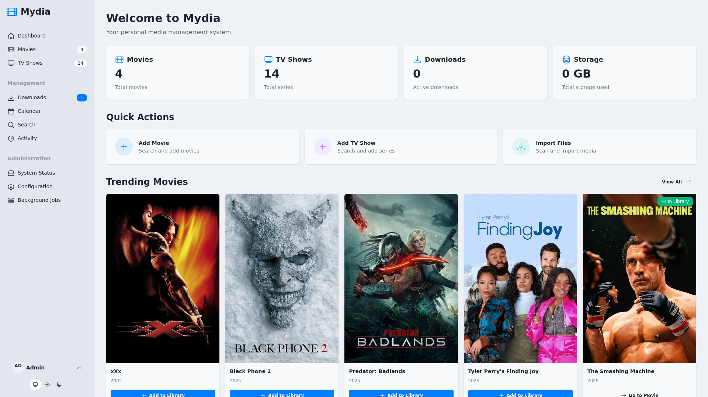
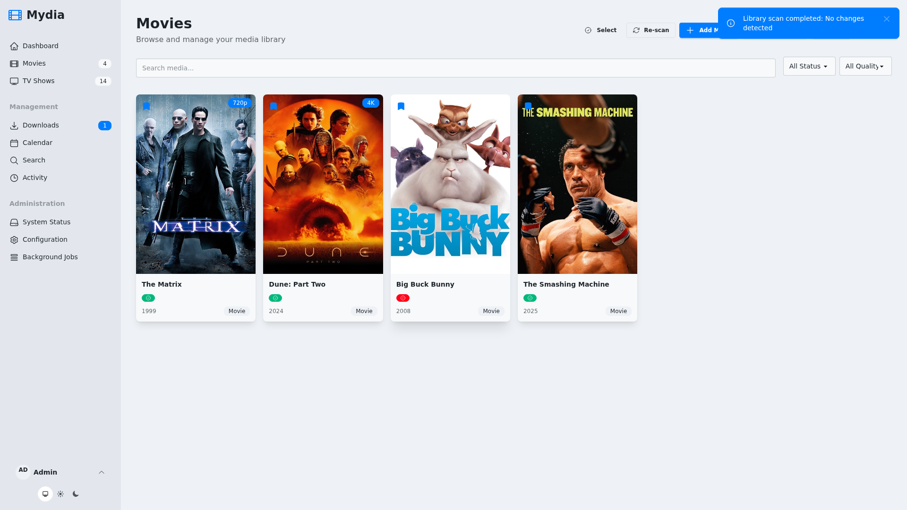
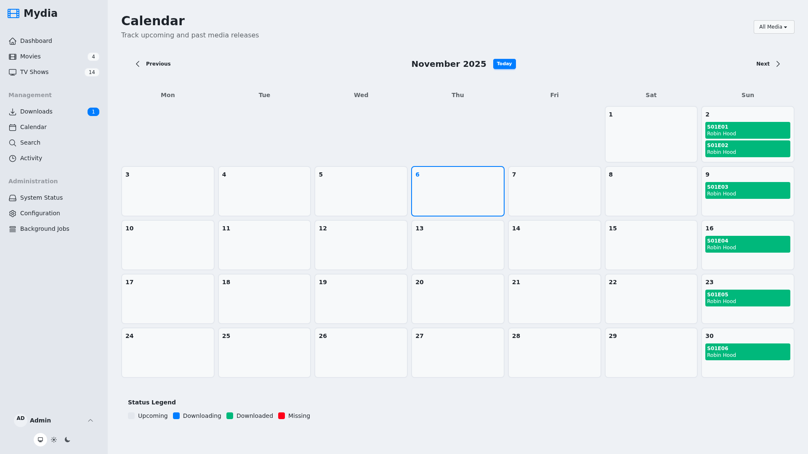
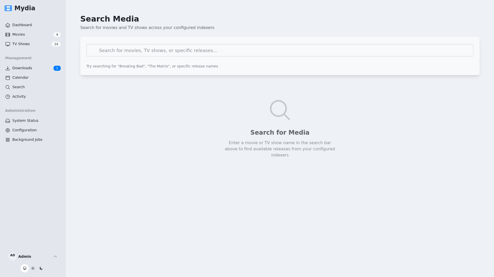

# 🎬 Mydia

> Your personal media companion, built with Phoenix LiveView

A modern, self-hosted media management platform for tracking, organizing, and monitoring your media library.

## ✨ Features

### Core Library Management
- 📺 **Smart Media Library** – Track TV shows, movies, and episodes with rich metadata from TMDB/TVDB
- 🔍 **Media Discovery** – Search and add content with automatic metadata matching and disambiguation
- 📁 **Library Scanner** – Automatic scanning and import of existing media files
- 🎯 **Advanced Filename Parser** – Intelligent extraction of titles, quality, codecs, and release groups using sequential pattern matching. Handles codec variations automatically (DDP5.1, DD5.1, x264, x.264) without maintenance
- 🎬 **Detailed Media Pages** – View comprehensive information including cast, crew, seasons, and episodes
- 📊 **Quality Profiles** – Customizable quality preferences for automated downloads

### Download Management
- ⬇️ **Download Client Integration** – Seamless connectivity with torrent clients (qBittorrent, Transmission) and Usenet clients (SABnzbd, NZBGet)
- 🔎 **Indexer Support** – Integrated search via Prowlarr and Jackett for finding releases
- 🤖 **Automatic Search & Download** – Background jobs to automatically find and download monitored content
- 🎯 **Smart Release Ranking** – Pluggable scoring system to select the best matching releases
- 📥 **Manual Search** – Browse and select specific releases from the UI
- 📋 **Download Queue** – Real-time monitoring of active downloads with progress tracking
- 🌐 **Usenet Support** – Native support for Usenet downloads with SABnzbd and NZBGet clients

### Monitoring & Tracking
- 🔔 **Release Calendar** – Track upcoming and past releases with timeline view
- 👁️ **Episode Monitoring** – Monitor individual episodes, seasons, or entire series
- 📊 **Missing Episodes** – Identify gaps in your library
- ⏱️ **Background Jobs** – Automated scanning, searching, and importing with Oban

### User Management & Access Control
- 👥 **Role-Based Access** – Admin and guest user roles with appropriate permissions
- 🎫 **Guest Request System** – Guests can browse media and submit requests for new content
- ✅ **Request Approval Workflow** – Admins review and approve/reject guest requests with notes
- 📊 **Request Tracking** – Users can monitor the status of their media requests
- 🔐 **Multi-Auth Support** – Local authentication and OIDC/OpenID Connect integration
- 🚀 **Auto-Promotion** – First OIDC user automatically promoted to admin role

### System & Configuration
- ⚙️ **Admin Dashboard** – System status, configuration management, and health monitoring
- 🔧 **Flexible Configuration** – Environment variables, YAML files, or database settings with clear precedence
- 🎨 **Modern UI** – Built with Phoenix LiveView, Tailwind CSS, and DaisyUI
- 🐳 **Docker Ready** – Pre-built images for amd64 and arm64 platforms

## 📸 Screenshots

<table>
  <tr>
    <td></td>
    <td></td>
  </tr>
  <tr>
    <td align="center"><b>Dashboard</b></td>
    <td align="center"><b>Movies</b></td>
  </tr>
  <tr>
    <td></td>
    <td></td>
  </tr>
  <tr>
    <td align="center"><b>TV Shows</b></td>
    <td align="center"><b>Calendar View</b></td>
  </tr>
  <tr>
    <td></td>
    <td></td>
  </tr>
  <tr>
    <td align="center"><b>Search</b></td>
    <td></td>
  </tr>
</table>

## 🏗️ Supported Architectures

Multi-platform images are available for the following architectures:

| Architecture | Available | Tag |
| :----: | :----: | ---- |
| x86-64 | ✅ | amd64-latest |
| arm64 | ✅ | arm64-latest |

The multi-arch image `ghcr.io/getmydia/mydia:latest` will automatically pull the correct image for your architecture.

## 🚀 Application Setup

1. **Generate required secrets:**

```bash
# Generate SECRET_KEY_BASE
openssl rand -base64 48

# Generate GUARDIAN_SECRET_KEY
openssl rand -base64 48
```

2. Set up your container using Docker Compose (recommended) or Docker CLI
3. Access the web interface at `http://your-server:4000`
4. On first startup, a default admin user is automatically created:
   - Check the container logs for the generated password
   - Default username: `admin` (configurable via `ADMIN_USERNAME`)
   - Or set `ADMIN_PASSWORD_HASH` to use a pre-hashed password
5. Configure download clients and indexers in the Admin section

## 📦 Usage

Here are some example snippets to help you get started creating a container.

### Docker Compose (Recommended)

```yaml
---
services:
  mydia:
    image: ghcr.io/getmydia/mydia:latest
    container_name: mydia
    environment:
      - PUID=1000
      - PGID=1000
      - TZ=America/New_York
      - SECRET_KEY_BASE=your-secret-key-base-here  # Required: generate with openssl rand -base64 48
      - GUARDIAN_SECRET_KEY=your-guardian-secret-key-here  # Required: generate with openssl rand -base64 48
      - PHX_HOST=localhost  # Change to your domain
      - PORT=4000
      - MOVIES_PATH=/media/library/movies
      - TV_PATH=/media/library/tv
    volumes:
      - /path/to/mydia/config:/config
      - /path/to/your/media:/media  # Single mount enables hardlinks between downloads and libraries
    ports:
      - 4000:4000
    restart: unless-stopped
```

> **Note:** This example uses a single `/media` mount to enable hardlink support. Organize your host directory with subdirectories like `/path/to/your/media/downloads`, `/path/to/your/media/library/movies`, and `/path/to/your/media/library/tv`. Configure your download client to save to `/media/downloads`.

### Docker CLI

```bash
docker run -d \
  --name=mydia \
  -e PUID=1000 \
  -e PGID=1000 \
  -e TZ=America/New_York \
  -e SECRET_KEY_BASE=your-secret-key-base-here \
  -e GUARDIAN_SECRET_KEY=your-guardian-secret-key-here \
  -e PHX_HOST=localhost \
  -e PORT=4000 \
  -e MOVIES_PATH=/media/library/movies \
  -e TV_PATH=/media/library/tv \
  -p 4000:4000 \
  -v /path/to/mydia/config:/config \
  -v /path/to/your/media:/media \
  --restart unless-stopped \
  ghcr.io/getmydia/mydia:latest
```

> **Note:** This example uses a single `/media` mount to enable hardlink support. Configure your download client to save to `/media/downloads`.

## 📋 Parameters

Container images are configured using parameters passed at runtime. These parameters are separated by a colon and indicate `external:internal` respectively.

### Ports (`-p`)

| Parameter | Function |
| :----: | --- |
| `4000:4000` | Web interface |

### Environment Variables (`-e`)

| Env | Function |
| :----: | --- |
| `PUID=1000` | User ID for file permissions - see [User / Group Identifiers](#user--group-identifiers) below |
| `PGID=1000` | Group ID for file permissions - see [User / Group Identifiers](#user--group-identifiers) below |
| `TZ=UTC` | Timezone (e.g., `America/New_York`) |
| `SECRET_KEY_BASE` | **Required** - Phoenix secret key (generate with: `openssl rand -base64 48`) |
| `GUARDIAN_SECRET_KEY` | **Required** - JWT signing key (generate with: `openssl rand -base64 48`) |
| `PHX_HOST=localhost` | Public hostname for the application |
| `PORT=4000` | Web server port |
| `MOVIES_PATH=/media/movies` | Movies directory path |
| `TV_PATH=/media/tv` | TV shows directory path |

See the **[Environment Variables Reference](#-environment-variables-reference)** section below for complete configuration options including download clients, indexers, and authentication.

### Volume Mappings (`-v`)

| Volume | Function |
| :----: | --- |
| `/config` | Application data, database, and configuration files |
| `/media/movies` | Movies library location |
| `/media/tv` | TV shows library location |
| `/media/downloads` | Download client output directory (optional) |

> **💡 Hardlink Support for Efficient Storage**
>
> For optimal storage efficiency, mydia uses hardlinks by default when importing media. Hardlinks allow the same file to appear in both your download folder and library folder without consuming additional disk space.
>
> **To enable hardlinks**, ensure your downloads and library directories are on the same filesystem by using a single parent volume mount:
>
> ```yaml
> volumes:
>   - /path/to/mydia/config:/config
>   - /path/to/your/media:/media  # Single mount for downloads AND libraries
> ```
>
> Then organize your host directory structure like:
> ```
> /path/to/your/media/
>   ├── downloads/          # Download client output
>   ├── library/
>   │   ├── movies/         # Movies library
>   │   └── tv/             # TV library
> ```
>
> And configure environment variables:
> ```yaml
> environment:
>   - MOVIES_PATH=/media/library/movies
>   - TV_PATH=/media/library/tv
> ```
>
> Configure your download client (qBittorrent, Transmission, etc.) to save files to `/media/downloads`.
>
> **Benefits:**
> - Instant file operations (no data copying)
> - Zero duplicate storage space
> - Files remain seeding in your download client while available in your library
>
> **Note:** If your downloads and libraries must be on different filesystems, mydia will automatically fall back to copying files. This works fine but uses more storage space and takes longer.

## 👤 User / Group Identifiers

When using volumes (`-v` flags), permissions issues can arise between the host and container. To avoid this, specify the user `PUID` and group `PGID` to ensure files created by the container are owned by your user.

**Finding your IDs:**

```bash
id your_user
```

Example output: `uid=1000(your_user) gid=1000(your_user)`

Use these values for `PUID` and `PGID` in your container configuration.

**Conflict Handling:**

The entrypoint script automatically handles conflicts when the specified PUID/PGID is already in use by another user or group in the container. For example, GID 100 is typically used by the "users" group in Alpine Linux. The container will automatically resolve these conflicts by removing the conflicting user/group and applying your specified IDs.

**Common scenarios:**
- Using `PGID=100` (conflicts with "users" group) - automatically handled ✓
- Using `PUID=99` (conflicts with "nobody" user on some systems) - automatically handled ✓
- Any custom UID/GID that matches your host system - automatically handled ✓

The container logs will show which conflicts were resolved during startup.

## 🔄 Updating the Container

### Via Docker Compose

```bash
docker compose pull
docker compose up -d
```

### Via Docker CLI

```bash
docker stop mydia
docker rm mydia
docker pull ghcr.io/getmydia/mydia:latest
# Run your docker run command again
```

**Note:** Migrations run automatically on startup. Your data in `/config` is preserved across updates.

### Beta Releases

Beta releases are available for testing new features before they are released to stable. Beta releases:
- Are tagged with `beta` instead of `latest`
- May contain experimental features or breaking changes
- Are not recommended for production use

To use a beta release:

```bash
# Pull the latest beta release
docker pull ghcr.io/getmydia/mydia:beta

# Or use a specific beta version
docker pull ghcr.io/getmydia/mydia:1.2.3-beta.1
```

Update your Docker Compose configuration:

```yaml
services:
  mydia:
    image: ghcr.io/getmydia/mydia:beta  # Use beta tag instead of latest
    # ... rest of configuration
```

See [DEPLOYMENT.md](docs/deployment/DEPLOYMENT.md) for advanced deployment topics.

## 📋 Environment Variables Reference

### Required Variables

| Variable | Description | Example |
|----------|-------------|---------|
| `SECRET_KEY_BASE` | Phoenix secret key for cookies/sessions | Generate with: `openssl rand -base64 48` |
| `GUARDIAN_SECRET_KEY` | JWT signing key for authentication | Generate with: `openssl rand -base64 48` |

### Container Configuration

| Variable | Description | Default |
|----------|-------------|---------|
| `PUID` | User ID for file permissions | `1000` |
| `PGID` | Group ID for file permissions | `1000` |
| `TZ` | Timezone (e.g., `America/New_York`, `Europe/London`) | `UTC` |
| `DATABASE_PATH` | Path to SQLite database file | `/config/mydia.db` |

### Server Configuration

| Variable | Description | Default |
|----------|-------------|---------|
| `PHX_HOST` | Public hostname for the application | `localhost` |
| `PORT` | Web server port | `4000` |
| `HOST` | Server binding address | `0.0.0.0` |
| `URL_SCHEME` | URL scheme for external links (http/https) | `http` |
| `PHX_CHECK_ORIGIN` | WebSocket origin checking. Set to `false` to allow all origins (useful for IP-based access), or comma-separated list of allowed origins | Allows `PHX_HOST` with any scheme |

### Media Library

| Variable | Description | Default |
|----------|-------------|---------|
| `MOVIES_PATH` | Movies directory path | `/media/movies` |
| `TV_PATH` | TV shows directory path | `/media/tv` |
| `MEDIA_SCAN_INTERVAL_HOURS` | Hours between library scans | `1` |

### Authentication

| Variable | Description | Default |
|----------|-------------|---------|
| `LOCAL_AUTH_ENABLED` | Enable local username/password auth | `true` |
| `ADMIN_USERNAME` | Default admin username (created on first startup) | `admin` |
| `ADMIN_EMAIL` | Default admin email (created on first startup) | `admin@mydia.local` |
| `ADMIN_PASSWORD_HASH` | Pre-hashed admin password (bcrypt). If not set, a random password is generated and logged | - |
| `OIDC_ENABLED` | Enable OIDC/OpenID Connect auth | `false` |
| `OIDC_DISCOVERY_DOCUMENT_URI` | OIDC discovery endpoint URL | - |
| `OIDC_CLIENT_ID` | OIDC client ID | - |
| `OIDC_CLIENT_SECRET` | OIDC client secret | - |
| `OIDC_REDIRECT_URI` | OIDC callback URL | Auto-computed |
| `OIDC_SCOPES` | Space-separated scope list | `openid profile email` |

**OIDC Provider Compatibility:**

Mydia uses standard OAuth2 authentication that works with **minimal provider configuration** - just set client_id, client_secret, and redirect_uris in your provider. No need to configure:
- `token_endpoint_auth_method` settings
- `response_modes` lists
- JWT-based authentication methods
- PAR (Pushed Authorization Request) settings

This should work with any standard OIDC provider including Keycloak, Authelia, Auth0, Okta, Azure AD, and Google.

See [docs/OIDC_TESTING.md](docs/OIDC_TESTING.md) for detailed setup instructions and provider examples.

**User Roles:**

- **Admin**: Full access to all features including media management, downloads, configuration, and request approval
- **Guest**: Can browse media library and submit requests for new content that require admin approval

**OIDC Auto-Promotion**: The first user to log in via OIDC is automatically promoted to admin role. Subsequent OIDC users are assigned the guest role by default.

**Admin User Creation:**

On first startup, if no admin user exists, Mydia automatically creates one:
- **Random Password** (default): A secure random password is generated and displayed in the container logs
- **Pre-set Password**: Use `ADMIN_PASSWORD_HASH` with a bcrypt hash for production deployments

Generate a bcrypt hash:
```bash
# Using Elixir/Mix (if available)
mix run -e "IO.puts Bcrypt.hash_pwd_salt(\"your_secure_password\")"

# Using Python
python3 -c "import bcrypt; print(bcrypt.hashpw(b'your_secure_password', bcrypt.gensalt()).decode())"
```

### Download Clients

Configure multiple download clients using numbered environment variables (`<N>` = 1, 2, 3, etc.):

| Variable Pattern | Description | Example |
|-----------------|-------------|---------|
| `DOWNLOAD_CLIENT_<N>_NAME` | Client display name | `qBittorrent` |
| `DOWNLOAD_CLIENT_<N>_TYPE` | Client type (qbittorrent, transmission, sabnzbd, nzbget, http) | `qbittorrent` |
| `DOWNLOAD_CLIENT_<N>_ENABLED` | Enable this client | `true` |
| `DOWNLOAD_CLIENT_<N>_PRIORITY` | Client priority (higher = preferred) | `1` |
| `DOWNLOAD_CLIENT_<N>_HOST` | Client hostname or IP | `qbittorrent` |
| `DOWNLOAD_CLIENT_<N>_PORT` | Client port | `8080` |
| `DOWNLOAD_CLIENT_<N>_USE_SSL` | Use SSL/TLS connection | `false` |
| `DOWNLOAD_CLIENT_<N>_USERNAME` | Authentication username (Transmission, qBittorrent, NZBGet) | - |
| `DOWNLOAD_CLIENT_<N>_PASSWORD` | Authentication password (Transmission, qBittorrent, NZBGet) | - |
| `DOWNLOAD_CLIENT_<N>_API_KEY` | API key (SABnzbd) | - |
| `DOWNLOAD_CLIENT_<N>_CATEGORY` | Default download category | - |
| `DOWNLOAD_CLIENT_<N>_DOWNLOAD_DIRECTORY` | Download output directory | - |

**Supported Download Clients:**
- **Torrent Clients**: qBittorrent, Transmission
- **Usenet Clients**: SABnzbd, NZBGet

Example configurations:

```bash
# qBittorrent
DOWNLOAD_CLIENT_1_NAME=qBittorrent
DOWNLOAD_CLIENT_1_TYPE=qbittorrent
DOWNLOAD_CLIENT_1_HOST=qbittorrent
DOWNLOAD_CLIENT_1_PORT=8080
DOWNLOAD_CLIENT_1_USERNAME=admin
DOWNLOAD_CLIENT_1_PASSWORD=adminpass

# Transmission
DOWNLOAD_CLIENT_2_NAME=Transmission
DOWNLOAD_CLIENT_2_TYPE=transmission
DOWNLOAD_CLIENT_2_HOST=transmission
DOWNLOAD_CLIENT_2_PORT=9091
DOWNLOAD_CLIENT_2_USERNAME=admin
DOWNLOAD_CLIENT_2_PASSWORD=adminpass

# SABnzbd (Usenet)
DOWNLOAD_CLIENT_3_NAME=SABnzbd
DOWNLOAD_CLIENT_3_TYPE=sabnzbd
DOWNLOAD_CLIENT_3_HOST=sabnzbd
DOWNLOAD_CLIENT_3_PORT=8080
DOWNLOAD_CLIENT_3_API_KEY=your-sabnzbd-api-key

# NZBGet (Usenet)
DOWNLOAD_CLIENT_4_NAME=NZBGet
DOWNLOAD_CLIENT_4_TYPE=nzbget
DOWNLOAD_CLIENT_4_HOST=nzbget
DOWNLOAD_CLIENT_4_PORT=6789
DOWNLOAD_CLIENT_4_USERNAME=nzbget
DOWNLOAD_CLIENT_4_PASSWORD=tegbzn6789
```

### Indexers

Configure multiple indexers using numbered environment variables (`<N>` = 1, 2, 3, etc.):

| Variable Pattern | Description | Example |
|-----------------|-------------|---------|
| `INDEXER_<N>_NAME` | Indexer display name | `Prowlarr` |
| `INDEXER_<N>_TYPE` | Indexer type (prowlarr, jackett, public) | `prowlarr` |
| `INDEXER_<N>_ENABLED` | Enable this indexer | `true` |
| `INDEXER_<N>_PRIORITY` | Indexer priority (higher = preferred) | `1` |
| `INDEXER_<N>_BASE_URL` | Indexer base URL | `http://prowlarr:9696` |
| `INDEXER_<N>_API_KEY` | Indexer API key | - |
| `INDEXER_<N>_INDEXER_IDS` | Comma-separated indexer IDs | `1,2,3` |
| `INDEXER_<N>_CATEGORIES` | Comma-separated categories | `movies,tv` |
| `INDEXER_<N>_RATE_LIMIT` | API rate limit (requests/sec) | - |

Example for Prowlarr:

```bash
INDEXER_1_NAME=Prowlarr
INDEXER_1_TYPE=prowlarr
INDEXER_1_BASE_URL=http://prowlarr:9696
INDEXER_1_API_KEY=your-prowlarr-api-key-here
```

Example for Jackett:

```bash
INDEXER_2_NAME=Jackett
INDEXER_2_TYPE=jackett
INDEXER_2_BASE_URL=http://jackett:9117
INDEXER_2_API_KEY=your-jackett-api-key-here
```

### Advanced Configuration

| Variable | Description | Default |
|----------|-------------|---------|
| `LOG_LEVEL` | Application log level (debug, info, warning, error) | `info` |

### Configuration Precedence

Configuration is loaded in this order (highest to lowest priority):

1. **Environment Variables** - Override everything
2. **Database Settings** - Configured via Admin UI
3. **YAML File** - From `config/config.yml`
4. **Schema Defaults** - Built-in defaults

## 🔧 Development

### Local Setup

**With Docker (Recommended):**

```bash
# Start everything
./dev up -d

# Run migrations
./dev mix ecto.migrate

# View at http://localhost:4000
# Check logs for the auto-generated admin password:
./dev logs | grep "DEFAULT ADMIN USER CREATED" -A 10
```

See all commands with `./dev`

**Without Docker:**

```bash
mix setup
mix phx.server
```

Visit [localhost:4000](http://localhost:4000)

### Releases

**Creating a stable release:**

Use the `/release` Claude Code command to automatically create a new release:

```bash
/release         # Auto-detect version bump (patch/minor/major)
/release patch   # Explicitly create a patch release (0.0.X)
/release minor   # Explicitly create a minor release (0.X.0)
/release major   # Explicitly create a major release (X.0.0)
```

This will:
1. Analyze changes since the last release
2. Update version in `mix.exs`
3. Create a commit and Git tag
4. Push to GitHub
5. Create a GitHub release with auto-generated notes
6. Trigger Docker image build and publish to GitHub Container Registry

**Creating a beta/rc release:**

Beta and release candidate (RC) releases are for testing new features before stable release:

```bash
/release beta    # Create a beta pre-release (e.g., v1.2.3-beta.1)
/release rc      # Create a release candidate (e.g., v1.2.3-rc.1)
```

Beta/RC releases:
- Do NOT update `mix.exs` version
- Do NOT create a commit (only a Git tag)
- Publish Docker images tagged with `beta` (not `latest`)
- Are marked as pre-release on GitHub
- Allow testing unreleased versions without affecting stable production deployments

### Continuous Integration

All pull requests and commits to the main branch automatically run:
- ✓ Code compilation with warnings as errors
- ✓ Code formatting checks
- ✓ Static analysis with Credo
- ✓ Full test suite
- ✓ Docker build verification

Run these checks locally before committing:

```bash
mix precommit
```

### Git Hooks

Automatic pre-commit hooks are available to catch formatting issues before they reach CI:

```bash
# Install hooks (one-time setup)
./scripts/install-git-hooks.sh
```

The pre-commit hook will automatically run `mix format --check-formatted` before each commit. If formatting issues are found, the commit will be blocked with instructions to fix them.

To bypass the hook in exceptional cases (not recommended):
```bash
git commit --no-verify
```

### Customization

Create `compose.override.yml` to add services like Transmission, Prowlarr, Jackett, or custom configurations:

```bash
cp compose.override.yml.example compose.override.yml
# Edit and uncomment services you need
./dev up -d
```

### Screenshots

Capture automated screenshots for documentation:

```bash
./take-screenshots
```

See `assets/SCREENSHOTS.md` for configuration options.

## 🛠️ Tech Stack

- Phoenix 1.8 + LiveView
- Ecto + SQLite
- Oban (background jobs)
- Tailwind CSS + DaisyUI
- Req (HTTP client)

---

Built with Elixir & Phoenix
